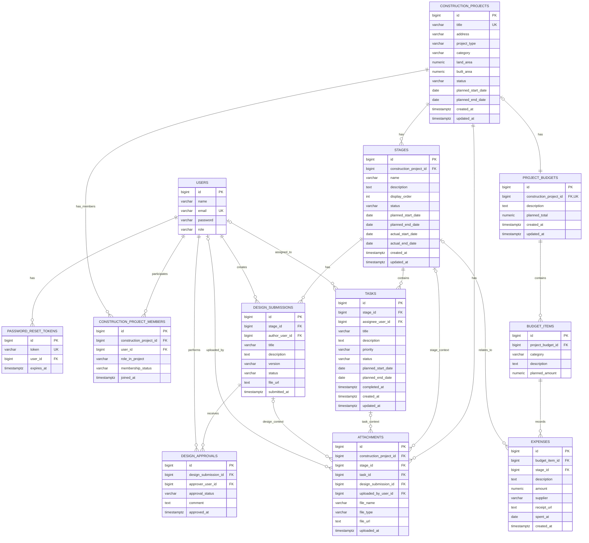

# Migrações do Banco de Dados PRISSMA

Este documento resume a **estrutura atual do banco** do PRISSMA, explicando o papel das principais tabelas e o **padrão de migrações** usado para evoluir o schema com segurança (via **Flyway**).

> Local sugerido para este arquivo no projeto: `src/main/resources/db/migration/README.md`

---

## Diagrama do Modelo de Dados

Quando a versão PNG do modelo estiver pronta, coloque-a na mesma pasta deste README e mantenha a linha abaixo:

---

## Estratégia de Migração (Flyway)

O projeto usa **Flyway** para versionar e aplicar mudanças no banco.

### Fluxo atual de migrações
- `V1__create_initial_schema.sql`
- `V2__create_construction_projects_core.sql`
- `V3__create_budget_tables.sql`
- `V4__create_design_tables.sql`
- `V5__create_attachments_table.sql`

### Regras para novas migrações
- **Não edite** migrações já executadas em ambientes compartilhados.
- Para alterar o schema, **crie uma nova migração**.
- Use nomes descritivos (ex.: `V6__add_due_date_to_tasks.sql`).
- Prefira **1 responsabilidade clara** por migração.

---

## Visão Geral (bem resumida)

- **Autenticação:** `users`, `password_reset_tokens`
- **Domínio PRISSMA:** projetos, membros, etapas, tarefas, orçamento, gastos, submissões/aprovações de design e anexos.
